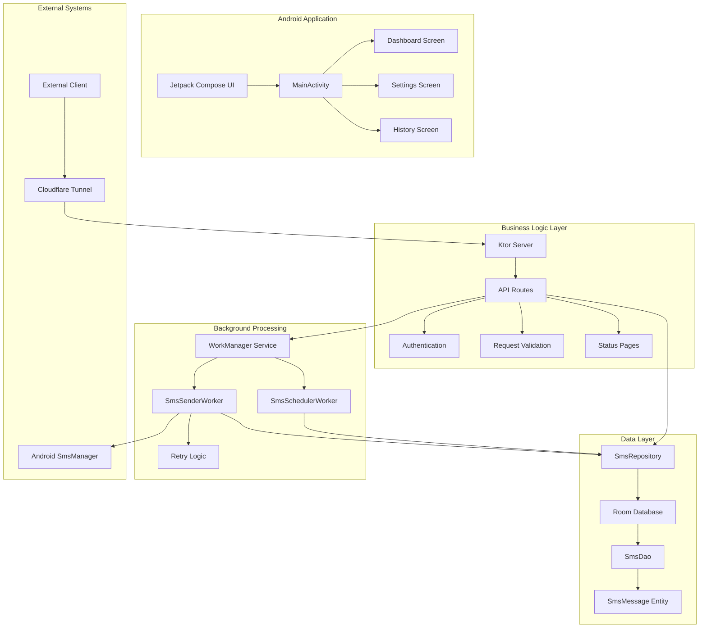
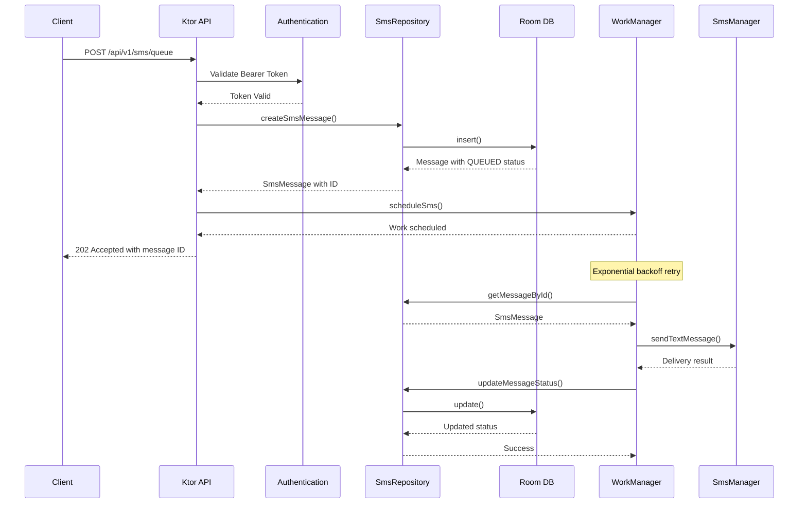
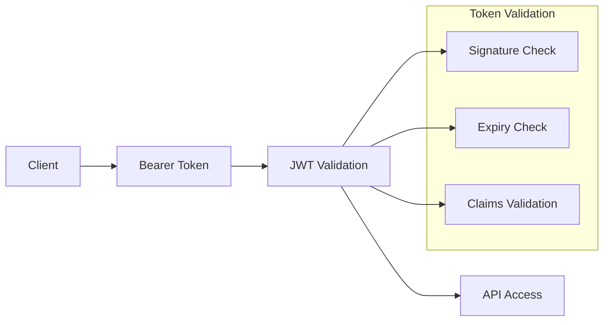

# ARCHITECTURE DIAGRAM - SMS Gateway

## System Architecture Overview



## Data Flow Diagram



## Component Inventory

### UI Layer (Jetpack Compose)
- **MainActivity**: Entry point, navigation setup
- **Dashboard**: Statistics overview, quick actions
- **History**: Message list with pagination
- **Settings**: Configuration management

### API Layer (Ktor Server)
- **KtorServer**: Main server configuration (port 8080)
- **SmsRoutes**: HTTP endpoints implementation
- **Authentication**: Bearer token validation
- **RequestValidation**: Input validation logic
- **StatusPages**: Error handling

### Data Layer (Room)
- **AppDatabase**: Database configuration, version 1
- **SmsDao**: Data access operations
- **SmsRepository**: Business logic abstraction
- **SmsMessage**: Entity definition (6 statuses)

### Background Processing (WorkManager)
- **WorkManagerService**: Abstraction layer
- **SmsSchedulerWorker**: Message scheduling
- **SmsSenderWorker**: SMS sending with retry

### External Integration
- **SmsManagerWrapper**: Android SMS API wrapper
- **Cloudflare Tunnel**: External access (planned)

## Error Handling Strategy

### Retry Logic Implementation
```kotlin
// Exponential backoff with jitter
val retryPolicy = BackoffPolicy.exponential(
    initialDelay = 5.minutes,    // 300,000ms
    multiplier = 2.0,            // Double each time
    maxDelay = 60.minutes        // Cap at 1 hour
)

// Retry sequence: 5m → 10m → 20m → 40m → 60m → 60m → 60m...
```

### Error Categories
1. **Network Errors**: Retry with exponential backoff
2. **SMS Failures**: Retry up to 3 times
3. **Validation Errors**: Immediate rejection
4. **System Errors**: Log and notify

## Performance Targets

### API Response Times
- **Health Check**: < 50ms
- **Queue SMS**: < 100ms
- **Status Check**: < 50ms
- **History List**: < 200ms (with pagination)

### Background Processing
- **SMS Scheduling**: < 1s to queue
- **SMS Sending**: < 30s per message
- **Retry Processing**: Configurable delays

### Database Performance
- **Insert Operations**: < 10ms
- **Query Operations**: < 50ms
- **Update Operations**: < 10ms

## Security Architecture

### Authentication Flow


### Security Measures
- **Bearer Token Authentication**: JWT-based
- **Input Validation**: Request validation layer
- **SQL Injection Protection**: Room ORM
- **Rate Limiting**: Planned implementation
- **HTTPS Enforcement**: Through Cloudflare

## Technology Stack

### Core Technologies
- **Platform**: Android (API 26-36)
- **Language**: Kotlin 2.0.21
- **UI Framework**: Jetpack Compose
- **Web Server**: Ktor 2.3.12
- **Database**: Room 2.6.1
- **Background**: WorkManager 2.9.0

### Key Dependencies
- **Serialization**: Kotlinx Serialization
- **Authentication**: JWT (4.4.0)
- **Coroutines**: Kotlinx Coroutines
- **DI**: Manual dependency injection
- **Testing**: JUnit5, Mockk

## Development Workflow

### Build Process
```bash
./gradlew build                    # Full build
./gradlew test                     # Run tests
./gradlew assembleDebug           # Debug APK
./gradlew assembleRelease        # Release APK
```

### Testing Strategy
- **Unit Tests**: Repository, Workers, Utils
- **Integration Tests**: API endpoints
- **Instrumentation Tests**: Database operations
- **UI Tests**: Compose interactions (planned)

## Deployment Architecture

### Local Development
- **Android Emulator/Device**: Direct deployment
- **Local Server**: Ktor on device (localhost:8080)
- **Local Database**: Room on device

### Production (Planned)
- **Cloudflare Tunnel**: External HTTPS access
- **APK Distribution**: Direct installation
- **Monitoring**: Structured logging
- **Updates**: Manual APK updates

## Monitoring & Observability

### Logging Strategy
- **Structured Logging**: JSON format
- **Log Levels**: DEBUG, INFO, WARN, ERROR
- **Categories**: API, Database, Workers, UI

### Metrics Collection (Planned)
- **API Response Times**: Endpoint performance
- **SMS Success Rates**: Delivery tracking
- **Error Rates**: Failure categorization
- **System Health**: Resource utilization

---
*Architecture documentation generated by ENFORCER Mode*
*All diagrams are Mermaid-compatible*