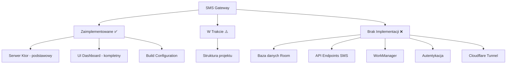

# SMS Gateway - Kontekst Projektu

## Przegląd Projektu

SMS Gateway to aplikacja Androidowa zaprojektowana do wysyłania zaplanowanych wiadomości SMS poprzez REST API. Aplikacja wykorzystuje Cloudflare Tunnel do bezpiecznego dostępu zewnętrznego oraz implementuje system kolejkowania dla przypomnień o wizytach z precyzyjną kontrolą timingową.

## Aktualny Stan Implementacji

### 📊 Postęp Ogólny: **15% zakończone**



## ✅ Zaimplementowane Komponenty

### 1. Infrastruktura Serwera
- **Lokalizacja**: [`app/src/main/java/com/smsgateway/app/KtorServer.kt`](app/src/main/java/com/smsgateway/app/KtorServer.kt:1)
- **Funkcjonalność**:
  - Serwer HTTP działający na porcie 8080
  - Podstawowe routing: `/`, `/api/v1/status`, `/api/v1/sms/send`
  - Odpowiedzi HTML i JSON
  - Uruchamiany w tle przez [`MainActivity`](app/src/main/java/com/smsgateway/app/MainActivity.kt:41)

### 2. Interfejs Użytkownika
- **Lokalizacja**: [`app/src/main/java/com/smsgateway/app/MainActivity.kt`](app/src/main/java/com/smsgateway/app/MainActivity.kt:57)
- **Komponenty**:
  - SMSGatewayApp - główna struktura nawigacji
  - Sidebar - panel nawigacyjny z logo
  - DashboardScreen - główny ekran ze statystykami
  - HistoryScreen, SendSMSScreen, SettingsScreen - ekrany placeholder
  - Statystyki (4 karty): SMS w kolejce, Wysłane dzisiaj, Błędy, Status systemu
  - Tabela ostatnich wiadomości z status badges
  - Szybkie akcje (4 przyciski)

### 3. Konfiguracja Build
- **Lokalizacja**: [`app/build.gradle.kts`](app/build.gradle.kts:1)
- **Status**: Rozwiązane problemy z kompilacją
- **Zależności**: Android, Compose, Ktor, Navigation

## ❌ Brakujące Komponenty Krytyczne

### 1. Baza Danych Room (0% zakończona)
**Wymagane pliki**:
- `app/src/main/java/com/smsgateway/app/database/AppDatabase.kt`
- `app/src/main/java/com/smsgateway/app/database/SmsDao.kt`
- `app/src/main/java/com/smsgateway/app/models/SmsMessage.kt`

**Funkcjonalności**:
- Entity dla wiadomości SMS
- DAO dla operacji CRUD
- Konfiguracja bazy SQLite

### 2. API Endpoints SMS (5% zakończona)
**Brakujące endpointy**:
- `POST /api/v1/sms/queue` - kolejkowanie SMS
- `GET /api/v1/sms/status/{id}` - sprawdzanie statusu
- `GET /api/v1/sms/history` - historia wiadomości
- `DELETE /api/v1/sms/cancel/{id}` - anulowanie wiadomości

**Brakujące modele**:
- `SmsRequest` DTO
- `SmsResponse` DTO
- `SmsStatus` enum

### 3. WorkManager (0% zakończona)
**Wymagane pliki**:
- `app/src/main/java/com/smsgateway/app/workers/SmsSchedulerWorker.kt`
- `app/src/main/java/com/smsgateway/app/workers/SmsSenderWorker.kt`

**Funkcjonalności**:
- Planowanie zadań (18h przed wizytą)
- Wysyłanie SMS (24h przed wizytą)
- Mechanizm retry
- Obsługa błędów

### 4. Autentykacja (0% zakończona)
**Brakujące komponenty**:
- Bearer Token middleware
- Walidacja tokenów
- Obsługa HTTP 401

### 5. Cloudflare Tunnel (0% zakończona)
**Brakujące komponenty**:
- Konfiguracja tunelu
- Integracja z cloudflared
- Zero Trust access

## 📋 Struktura Projektu

```
app/src/main/java/com/smsgateway/app/
├── MainActivity.kt              ✅ Kompletny UI
├── KtorServer.kt               ✅ Podstawowy serwer
├── ui/theme/                   ✅ Komponenty UI
│   ├── Color.kt
│   ├── Theme.kt
│   └── Type.kt
├── database/                   ❌ Brak
│   ├── AppDatabase.kt
│   └── SmsDao.kt
├── workers/                    ❌ Brak
│   ├── SmsSchedulerWorker.kt
│   └── SmsSenderWorker.kt
├── models/                     ❌ Brak
│   └── SmsMessage.kt
├── routes/                     ❌ Brak
│   └── SmsRoutes.kt
└── plugins/                    ❌ Brak
    └── Authentication.kt
```

## 🚨 Kluczowe Problemy

1. **Brak bazy danych** - nie ma gdzie przechowywać wiadomości
2. **Brak logiki SMS** - endpoint `/api/v1/sms/send` zwraca tylko "not_implemented"
3. **Brak przetwarzania w tle** - nie ma WorkManager do planowania wysyłki
4. **Brak autentykacji** - API jest całkowicie otwarte
5. **Brak integracji z Android SMS API** - nie ma możliwości wysyłania SMS

## 📅 Historia Rozwoju

### 2025-10-22 17:21 - Build Fix
- Rozwiązano problemy z Java 25 → Java 17
- Naprawiono błędy w build.gradle.kts
- Usunięto konflikty META-INF
- Poprawiono błędy Lint w AndroidManifest.xml
- Przeniesiono KtorServer.kt do właściwej lokalizacji

### 2025-10-22 17:40 - UI Implementation
- Zaimplementowano kompletny UI dashboard
- Dodano nawigację między ekranami
- Stworzono statystyki i tabelę wiadomości
- Dodano szybkie akcje

## 🎯 Następne Kroki

1. **Faza 1: Baza Danych**
   - Utworzyć encję SmsMessage
   - Zaimplementować SmsDao
   - Skonfigurować AppDatabase

2. **Faza 2: API Implementation**
   - Zaimplementować wszystkie endpointy SMS
   - Dodać modele DTO
   - Stworzyć routing

3. **Faza 3: WorkManager**
   - Utworzyć SmsSchedulerWorker
   - Zaimplementować SmsSenderWorker
   - Dodać logikę retry

4. **Faza 4: Autentykacja**
   - Dodać Bearer Token middleware
   - Zaimplementować walidację

5. **Faza 5: Cloudflare Integration**
   - Skonfigurować tunel
   - Zintegrować z cloudflared

## 📊 Wymagania z PRD.md vs Stan Aktualny

| Komponent | Wymaganie PRD | Stan Aktualny | % Ukończenia |
|-----------|---------------|---------------|--------------|
| Serwer Ktor | HTTP na 8080 | ✅ Zaimplementowany | 100% |
| Baza Room | SQLite + DAO | ❌ Brak | 0% |
| API SMS | 4 endpointy | ⚠️ 1 placeholder | 5% |
| WorkManager | 2 workery | ❌ Brak | 0% |
| Autentykacja | Bearer token | ❌ Brak | 0% |
| UI Dashboard | Material Design | ✅ Kompletny | 100% |
| Cloudflare | Tunel HTTPS | ❌ Brak | 0% |

## 🔧 Technologie

**Zaimplementowane**:
- Kotlin 2.0.0
- Android SDK 24+
- Ktor 2.3.12 (Netty)
- Jetpack Compose
- Navigation Compose

**Brakujące**:
- Room 2.6.1
- WorkManager 2.9.0
- Kotlinx Serialization
- Cloudflared integration

## 📝 Notatki Deweloperskie

- Projekt kompiluje się bez błędów
- UI jest w pełni funkcjonalne ale nie połączone z backendem
- Serwer Ktor działa ale ma tylko podstawowe endpointy
- Brak jakichkolwiek testów jednostkowych
- Wszystkie logi z developmentu są w katalogu `progress/`